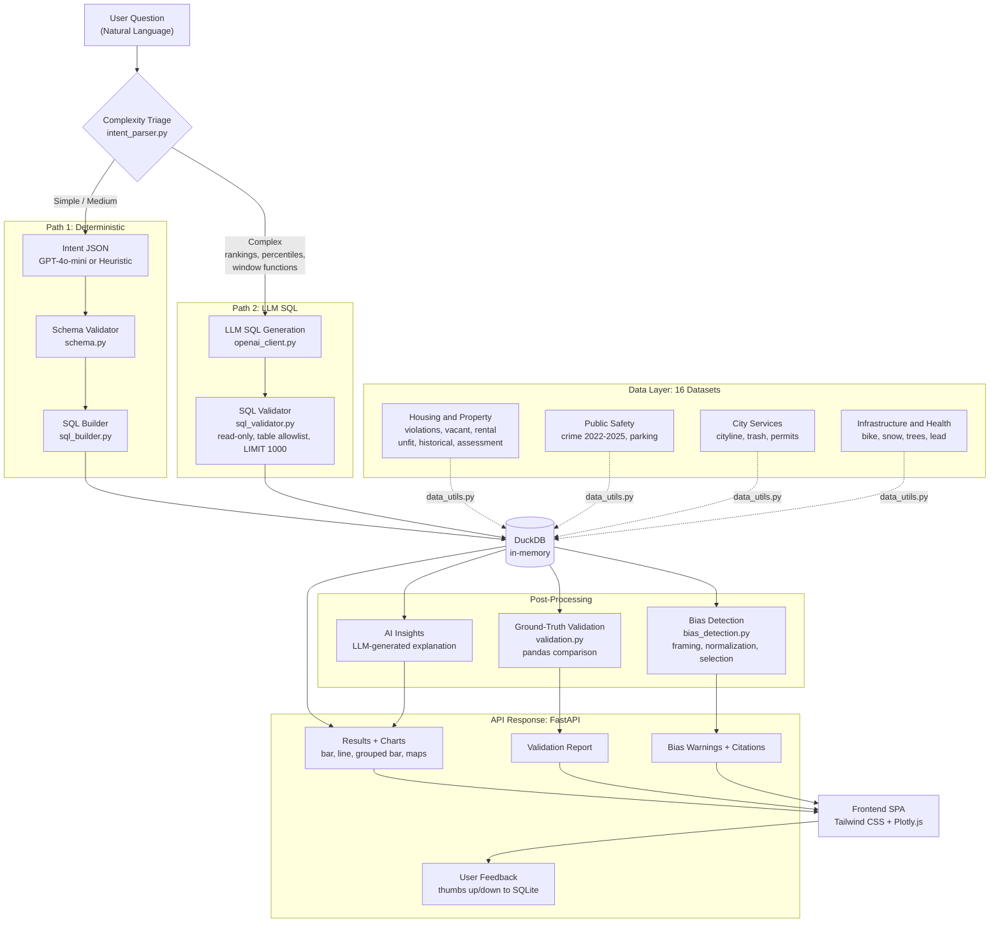

# Ask Syracuse Data

A natural language interface for querying Syracuse Open Data. Ask questions in plain English and get data-driven answers with interactive visualizations, validation, and bias warnings.

## Features

- **Natural Language Queries**: Ask questions like "How many violations by neighborhood?" or "What's the average parking fine?"
- **16 Datasets**: Housing, public safety, city services, infrastructure, and public health data
- **Interactive Web UI**: Landing page with dataset explorer, charts, maps (bubble, point, and route line maps), and tabbed results
- **Cross-Dataset Analysis**: Join violations with rental properties, vacant properties, crime data, and unfit properties
- **Hybrid Architecture**: Simple queries use deterministic SQL; complex queries use LLM-generated SQL with guardrails
- **Auto-Insights**: AI-generated insights explaining what the data means
- **Validation**: Ground-truth comparison ensures query results match direct pandas calculations
- **Bias Detection**: Automatic warnings for framing, normalization, selection, and context biases
- **Null Handling**: 12 datasets use "label" strategy — nulls replaced with descriptive text so they appear in GROUP BY results instead of being silently dropped
- **Data Citations**: Full source attribution with dataset caveats and limitations
- **User Feedback**: Thumbs up/down with optional comments, stored in SQLite for tracking query quality

## Datasets

16 Syracuse Open Data sources (static CSV snapshots):

| Category | Dataset | Records | Key Queryable Columns | Description |
|----------|---------|---------|----------------------|-------------|
| **Housing & Property** | Code Violations | ~138K | neighborhood, zip, status, year; avg/min/max days_to_comply | Housing code enforcement (2017-present) |
| | Vacant Properties | ~1.7K | neighborhood, zip | Administratively identified vacancies |
| | Rental Registry | ~13K | zip, sbl, completion_type | Registered rental property inspections |
| | Unfit Properties | 353 | zip, department, complaint_type | Properties declared unfit for habitation |
| | Historical Properties | 3,486 | zip, nr_eligible, lpss | Landmark and National Register eligible properties |
| | Assessment Roll | ~41K | prop_class_description, zip (extracted); avg/sum total_av | Property assessments and classifications (2026) |
| **Public Safety** | Crime Data | ~32.8K | neighborhood, zip, code_defined, year, crime_part | Part 1 & 2 offenses (2022-2025) |
| | Parking Violations | ~197K | description, status, zip, year; avg/min/max/sum amount | Parking tickets issued (2023) |
| **City Services** | SYRCityline Requests | ~116K | category, agency, report_source, year; avg minutes_to_close | 311 service requests |
| | Trash Pickup | ~41K | sanitation day, recycling day, zip | Collection schedules (2025) |
| | Permit Requests | ~47K | permit_type, zip, year | Building permit applications |
| **Infrastructure** | Bike Suitability | 868 | suitability rating | Road bike suitability ratings (2020) |
| | Bike Infrastructure | 59 | type; sum miles | Bike lanes, trails, and paths (2023) |
| | Snow Routes | 3,685 | zip | Emergency snow route road segments |
| | Tree Inventory | ~55K | neighborhood, condition, species (spp_com) | City-managed tree inventory |
| **Public Health** | Lead Testing | 1,185 | census_tract, year (2013-2024) | Elevated lead levels by census tract |

## Architecture



- **Complexity Triage**: Routes queries by complexity — simple/medium queries get deterministic SQL via intent JSON; complex queries get LLM-generated SQL with guardrails
- **Schema Validation**: Enforces allowed datasets, fields, metrics, and filters
- **SQL Builder**: Generates deterministic DuckDB queries (single-table, joins via CTE or LEFT JOIN)
- **SQL Validator**: Guardrails for LLM-generated SQL (read-only, table allowlist, LIMIT 1000)
- **Validation**: Compares results against pandas ground-truth calculations
- **Bias Detection**: Warns about framing, normalization, selection, and context biases
- **Feedback Loop**: Collects user ratings (thumbs up/down + comments) via SQLite (`data/feedback.db`)

## Tech Stack

- **Backend**: FastAPI + DuckDB (in-memory SQL on pandas DataFrames)
- **Frontend**: Tailwind CSS + Plotly.js (single-page app)
- **LLM**: OpenAI GPT-4o-mini (intent parsing only — never touches data)
- **Deployment**: Hugging Face Spaces (Docker) or Render.com

## Setup

### Prerequisites

- Python 3.10+
- pip
- (Optional) OpenAI API key for AI-powered features — the app works without it via heuristic fallback

### Installation

```bash
# 1. Clone the repository
git clone https://github.com/prathyusha1231/Ask-Syracuse-Data.git
cd Ask-Syracuse-Data

# 2. Create and activate a virtual environment
python -m venv venv
.\venv\Scripts\activate    # Windows
# source venv/bin/activate  # macOS/Linux

# 3. Install dependencies
pip install -r requirements.txt

# 4. Download data files to data/raw/ (see Data Sources below)
mkdir -p data/raw
# Place all CSV/XLSX files from Syracuse Open Data Portal into data/raw/

# 5. (Optional) Create .env file for AI features
echo "OPENAI_API_KEY=sk-..." > .env

# 6. Start the web app
python -m uvicorn app:app --reload
# Open http://127.0.0.1:8000
```

### Environment Variables

| Variable | Required | Description |
|----------|----------|-------------|
| `OPENAI_API_KEY` | No | OpenAI API key for AI intent parsing and insights. Without it, the heuristic parser handles common queries. |
| `PORT` | No | Port for the web server (default: 8000). Set automatically on Render/HF Spaces. |

## Example Queries

| Category | Question | What it does |
|----------|----------|--------------|
| Housing | "How many code violations are there?" | Total count |
| Housing | "Violations by neighborhood since 2020" | Filtered, grouped count |
| Housing | "Average days to comply by neighborhood" | Computed column metric |
| Housing | "Neighborhoods with more than 100 violations" | HAVING threshold |
| Safety | "Crime by year" | Multi-year temporal breakdown |
| Safety | "How many parking violations by type?" | Parking tickets grouped |
| Safety | "Average parking fine by type" | Computed column metric (amount) |
| Services | "Service requests by category" | 311 request breakdown |
| Services | "Service requests by agency" | Agency-level grouping |
| Services | "Trash pickup by collection day" | Schedule breakdown |
| Property | "Average property assessment by class" | Assessment metrics |
| Property | "Assessment by zip code" | ZIP-level property values |
| Property | "Historical properties by NR eligibility" | Landmark data |
| Infra | "Bike infrastructure by type" | Lane/trail/path counts |
| Infra | "How many miles of bike lanes?" | Sum metric |
| Trees | "Most common tree species" | Species count_distinct |
| Trees | "Trees by neighborhood" | Neighborhood distribution |
| Health | "Lead testing by census tract" | Public health data |
| Health | "Lead testing by year" | Temporal trend (2013-2024) |
| Joins | "Rental properties with violations by zip" | Cross-dataset join |
| Joins | "Compare crime and violations by neighborhood" | Crime + violations |

## Data Sources

Download from [Syracuse Open Data](https://data.syr.gov) and place in `data/raw/`:

- `Code_Violations_V2.csv`
- `Syracuse_Rental_Registry.csv`
- `Vacant_Properties.csv`
- `Crime_Data_2022_(Part_1_Offenses).csv`
- `Crime_Data_2023_(Part_1_Offenses).csv`
- `Crime_Data_2023_(Part_2_Offenses).csv`
- `Crime_Data_2024_(Part_1_Offenses).csv`
- `Crime_Data_2024_(Part_2_Offenses).csv`
- `Crime_Data_2025_(Part_1_Offenses).csv`
- `Unfit_Properties.csv`
- `Trash_Pickup_2025.csv`
- `Historical_Properties.csv`
- `Assessment_Roll_2026.csv`
- `SYRCityline_Requests.csv`
- `Emergency_Snow_Routes.csv`
- `Bike_Suitability_2020.csv`
- `Bike_Infrastructure_2023.csv`
- `Parking_Violations_2023.csv`
- `Permit_Requests.csv`
- `Tree_Inventory.csv`
- `Lead_Testing_2013_2019.xlsx`
- `Lead_Testing_2020_2024.xlsx`

## LLM Usage

- **Scope**: LLM converts natural language to JSON intent only (Path 1) or generates SQL with guardrails (Path 2)
- **Heuristic Fallback**: Common queries work without an API key via keyword-based intent parsing
- **Guardrails**: All intents validated against schema; LLM SQL restricted to read-only, allowed tables only, LIMIT 1000
- **Data Access**: The LLM never sees raw data — all computations happen in DuckDB

## Validation & Bias Detection

**Validation (validation.py)**
- Compares query results against ground-truth pandas calculations
- Sanity checks for outliers, null groups, and suspicious counts
- Validates join results against direct merge operations

**Bias Detection (bias_detection.py)**
- **Framing**: Warns about leading language ("most dangerous", "worst")
- **Normalization**: Alerts when raw counts need population context
- **Selection**: Notes dataset-specific collection biases
- **Context**: Identifies missing analytical context
- **Uncertainty**: Flags sources of uncertainty in results

View these in the **Validation** and **Sources** tabs in the web UI.

## User Feedback

Every query result includes thumbs up/down buttons with an optional comment box. Feedback is stored in SQLite (`data/feedback.db`) with full context: question, SQL, dataset, and a unique query ID.

**API Endpoints:**
- `POST /api/feedback` — Submit feedback (query_id, question, rating, optional comment)
- `GET /api/feedback/stats` — View totals and recent feedback entries

## Testing

```bash
# Benchmark tests (13 tests, no LLM needed)
python -m tests.eval_benchmarks

# With LLM
python -m tests.eval_benchmarks --llm

# Comprehensive tests (30 questions)
python -m tests.test_app_comprehensive

# Dataset tests (37 queries across all 16 datasets, requires running server)
python -m tests.test_all_datasets
```

## Deploy

**Hugging Face Spaces (Docker):**
1. Create a new Space with Docker SDK (Blank template)
2. Copy project files + `data/raw/` into the Space repo
3. Push — the included `Dockerfile` handles the build
4. Set `OPENAI_API_KEY` as a secret in Space Settings (optional)

**Render.com:**
- `render.yaml` is included — connect your GitHub repo and set `OPENAI_API_KEY` in the dashboard

## Limitations

- Administrative records reflect reporting/enforcement patterns, not ground truth
- Crime data covers 2022-2025 (Part 1 & 2 offenses; 2025 is partial with only 33 rows); addresses generalized to block level
- Counts should be normalized for fair neighborhood comparisons
- Assessed values may differ from market values
- Lead testing data is census-tract level (research use)
- Static CSV snapshots — not live data

## License

MIT
